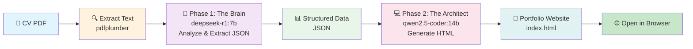

# 🤖 Local AI Agent: PDF to Portfolio Generator

<div align="center">

**Transform your CV into a stunning, AI-generated portfolio website — 100% locally, no API keys required.**

[](https://www.python.org/downloads/)
[](https://ollama.ai)
[](LICENSE)
[](#-architecture-solid-principles)

[🚀 Quick Start](#-quick-start) • [📖 Features](#-features) • [⚙️ Setup](#-installation) • [🎯 Usage](#-usage) • [📂 Structure](#-project-structure)

</div>

---

## ✨ Features

- 🔒 **100% Local & Private** — Runs entirely on your machine using Ollama. No cloud uploads, no tracking, no external APIs.
- 🆓 **Zero API Costs** — No OpenAI, Claude, or Anthropic subscriptions required. Completely free.
- 🧠 **Anti-Hallucination Mode** — Uses strict, exact-text extraction from your CV. No invented experience or fabricated credentials.
- 🎨 **Modern, Beautiful Output** — Generates responsive HTML with Bento Grid layouts, glassmorphism effects, Tailwind CSS, and smooth AOS animations.
- ⚡ **VRAM Optimized** — Loads and unloads models sequentially to fit on consumer GPUs (8GB+). No need for high-end enterprise hardware.
- 🔄 **End-to-End Automation** — From PDF to production-ready website in one click.
- 🏗️ **SOLID Architecture** — Modular, extensible design. Easy to add new document formats, LLM providers, or UI implementations.

---

## 🛠️ Tech Stack

| Component | Technology | Purpose |
|-----------|-----------|---------|
| **Language** | Python 3.12+ | Core application |
| **LLM Inference** | Ollama | Local model serving |
| **PDF Processing** | PDFPlumber | Text extraction from CV |
| **AI Models** | DeepSeek-R1:7b + Qwen2.5-Coder:14b | Reasoning + Code generation |
| **GUI** | Tkinter | File selection & notifications |
| **Frontend** | Tailwind CSS, Lucide Icons, AOS.js | Portfolio website styling |
| **Architecture** | SOLID Principles | Modular, testable, extensible |

---

## 📋 Prerequisites

### System Requirements

- **OS**: Windows, macOS, or Linux
- **Python**: 3.12 or higher
- **GPU** (Recommended): NVIDIA with 8GB+ VRAM (12GB optimal for RTX 3060)
  - *CPU mode works but is **very** slow (~5-10 min per model)*
- **Disk Space**: ~15GB (for downloading LLM models)
- **RAM**: 16GB+ recommended for smooth operation

### Software Prerequisites

1. **Python 3.12+** — [Download here](https://www.python.org/downloads/)
2. **Ollama** — [Download from ollama.ai](https://ollama.ai)
3. **Git** (optional, for cloning) — [Download here](https://git-scm.com/)

---

## 🚀 Installation

### Step 1: Clone or Download the Repository

```bash
# Using Git
git clone https://github.com/yourusername/cv-portfolio-ai.git
cd cv-portfolio-ai

# OR download as ZIP and extract
```

### Step 2: Create a Virtual Environment

```bash
# Windows
python -m venv venv
.\venv\Scripts\activate

# macOS/Linux
python3 -m venv venv
source venv/bin/activate
```

You should see `(venv)` at the start of your terminal prompt.

### Step 3: Install Python Dependencies

```bash
pip install -r requirements.txt
```

**What gets installed:**
- `pdfplumber` — PDF text extraction
- `ollama` — Python client for Ollama
- `tkinter` — Built-in GUI (usually pre-installed with Python)

### Step 4: ⭐ Download the AI Models

This is the **crucial** step. Open your terminal and run:

```bash
# Download DeepSeek-R1:7b (reasoning model)
ollama pull deepseek-r1:7b

# Download Qwen2.5-Coder:14b (code generation model)
ollama pull qwen2.5-coder:14b
```

⏱️ **Time required:** ~10-20 minutes (depends on internet speed)
💾 **Space required:** ~15GB total

You only need to do this **once**. The models are cached locally.

### Step 5: Verify Installation

```bash
# List downloaded models
ollama list
```

You should see both `deepseek-r1:7b` and `qwen2.5-coder:14b` in the output.

---

## 📖 Usage

### Running the Pipeline

1. **Start Ollama Server** (if not already running):
   ```bash
   ollama serve
   ```
   Keep this terminal open — it runs the local LLM server.

2. **Open a new terminal and run the pipeline**:
   ```bash
   cd cv-portfolio-ai
   .\venv\Scripts\activate  # (Windows)
   # source venv/bin/activate  # (macOS/Linux)
   
   python main.py
   ```

3. **Select your CV PDF** — A file dialog will appear. Choose your CV file.

4. **Wait for processing**:
   - **Phase 1 (The Brain)**: DeepSeek analyzes your CV → ~2-3 minutes
   - **Phase 2 (The Architect)**: Qwen generates HTML → ~3-4 minutes
   - Total time: ~5-7 minutes (on RTX 3060)

5. **Success!** 🎉
   - Generated portfolio saved to `outputs/index.html`
   - Also saved as `outputs/{CV_Name}_portfolio_{timestamp}.html`
   - A success dialog will pop up with file locations.

### Output Files

After running, check the `outputs/` folder:

```
outputs/
├── index.html                              # Latest portfolio (quick access)
├── cv_raw_text.txt                         # Extracted CV text (for debugging)
├── cv_extracted_data.json                  # Structured data (for debugging)
└── Mesut_KirazCVen_portfolio_20260112.html # Timestamped backup
```

**Open `index.html` in your browser** to view your portfolio!

---

## 🏗️ Architecture: SOLID Principles

The project is refactored with **SOLID principles** for maximum maintainability and extensibility:

### Project Structure

```
src/
├── interfaces/                    # Abstract contracts
│   ├── document_extractor.py     # PDF/Word/OCR interface
│   ├── llm_service.py            # LLM provider interface
│   ├── cv_analyzer.py            # CV analysis interface
│   ├── portfolio_generator.py    # HTML generation interface
│   ├── file_service.py           # File operations interface
│   └── ui_service.py             # UI operations interface
│
├── models/                        # Data structures
│   ├── cv_data.py                # Structured CV data model
│   └── config.py                 # Configuration management
│
├── services/                      # Concrete implementations
│   ├── ollama_service.py         # Ollama LLM client
│   ├── pdf_extractor.py          # PDF text extraction
│   ├── deepseek_analyzer.py      # CV analysis with DeepSeek
│   ├── qwen_portfolio_generator.py # HTML generation with Qwen
│   ├── local_file_service.py     # Local filesystem operations
│   └── tkinter_ui_service.py     # Desktop GUI with Tkinter
│
├── pipeline/                      # Orchestration & DI
│   ├── container.py              # Dependency Injection container
│   └── cv_portfolio_pipeline.py  # Main orchestrator
│
└── utils/                         # Utilities
    ├── logger.py                 # Pretty console logging
    └── parsers.py                # JSON/HTML parsing helpers
```

### SOLID Principles in Action

| Principle | How It's Applied |
|-----------|------------------|
| **Single Responsibility** | Each class has ONE job: `PDFExtractor` only extracts text, `OllamaService` only calls LLM, etc. |
| **Open/Closed** | Add new document formats (DOCX, images) without modifying existing code. |
| **Liskov Substitution** | Swap `OllamaService` for `OpenAIService` without changing pipeline code. |
| **Interface Segregation** | 6 small, focused interfaces. Implementations depend only on what they need. |
| **Dependency Inversion** | `DependencyContainer` manages all concrete implementations. Pipeline depends on abstractions. |

### Example: Extending with Custom LLM Provider

```python
from src.interfaces import ILLMService
from src.pipeline import DependencyContainer, CVPortfolioPipeline

# Implement your custom LLM service
class OpenAILLMService(ILLMService):
    def chat(self, messages, model, config=None):
        # Your OpenAI implementation
        pass
    
    # ... implement other methods

# Swap it in
container = DependencyContainer()
container.set_llm_service(OpenAILLMService())
pipeline = CVPortfolioPipeline(container=container)
pipeline.run()
```

No changes to pipeline code needed! 🎯

---

## ⚙️ Configuration

### Switching Models (For Lower VRAM)

If you have less than 12GB VRAM, use smaller models:

**Edit `src/models/config.py`:**

```python
@dataclass
class LLMModelsConfig:
    # Default (recommended for 12GB+ VRAM)
    brain_model: str = "deepseek-r1:7b"       # 7B reasoning model
    coder_model: str = "qwen2.5-coder:14b"    # 14B code model
    
    # For 8GB VRAM, use smaller versions
    # brain_model: str = "deepseek-r1:1.5b"   # 1.5B reasoning model
    # coder_model: str = "qwen2.5-coder:7b"   # 7B code model
```

**Then download the smaller models:**

```bash
ollama pull deepseek-r1:1.5b
ollama pull qwen2.5-coder:7b
```

**Or use the config at runtime:**

```python
from src.models.config import AppConfig
from src.pipeline import CVPortfolioPipeline

config = AppConfig.with_models(
    brain_model="deepseek-r1:1.5b",
    coder_model="qwen2.5-coder:7b"
)
pipeline = CVPortfolioPipeline(config=config)
pipeline.run()
```

### Other Configuration Options

Edit `src/models/config.py`:

```python
@dataclass
class AppConfig:
    # Model configuration
    models: LLMModelsConfig = field(default_factory=LLMModelsConfig)
    
    # Output directory
    output_dir: Path = field(default_factory=lambda: Path("outputs"))
    
    # LLM settings
    analysis_temperature: float = 0.3    # Lower = more factual (don't change)
    generation_temperature: float = 0.2  # Lower = more consistent code (don't change)
    context_window: int = 8192           # Model's max context (leave as-is)
    max_tokens: int = 4096               # Max output length (safe to increase)
```

---

## 🔄 Pipeline Workflow



### What Happens at Each Stage

| Stage | Tool | Input | Output | Time |
|-------|------|-------|--------|------|
| **Extraction** | pdfplumber | CV PDF | Raw text | ~5 sec |
| **Phase 1: Brain** | DeepSeek-R1:7b | CV text | Structured JSON | ~2-3 min |
| **Phase 2: Architect** | Qwen2.5-Coder:14b | JSON data | HTML + CSS + JS | ~3-4 min |
| **Total** | — | PDF | index.html | ~5-7 min |

---

## 📚 Example: CV to Portfolio

### Input: Raw CV Text
```
John Doe
Senior Full-Stack Developer
john@example.com | github.com/johndoe | linkedin.com/in/johndoe

EXPERIENCE:
Acme Corp (2020 - Present)
- Built microservices using Python and FastAPI
- Led team of 3 engineers
```

### Phase 1 Output: Structured JSON
```json
{
    "personal": {
        "name": "John Doe",
        "title": "Senior Full-Stack Developer",
        "email": "john@example.com"
    },
    "links": {
        "github": "github.com/johndoe",
        "linkedin": "linkedin.com/in/johndoe"
    },
    "experience": [
        {
            "company": "Acme Corp",
            "role": "Senior Full-Stack Developer",
            "period": "2020 - Present",
            "highlights": [
                "Built microservices using Python and FastAPI",
                "Led team of 3 engineers"
            ]
        }
    ]
}
```

### Phase 2 Output: Beautiful Portfolio Website
Qwen generates a complete, production-ready HTML website with:
- ✅ Dark theme (pitch black + emerald accent)
- ✅ Responsive Bento Grid layout
- ✅ Glassmorphism cards with hover effects
- ✅ Smooth AOS scroll animations
- ✅ Tailwind CSS styling
- ✅ Lucide Icons (SVG, no images)
- ✅ Mobile-friendly responsive design

---

## 🐛 Troubleshooting

### "ModuleNotFoundError: No module named 'ollama'"
```bash
# Make sure virtual environment is activated
.\venv\Scripts\activate  # Windows
# source venv/bin/activate  # macOS/Linux

# Reinstall dependencies
pip install -r requirements.txt
```

### "Model not found" Error
```bash
# Pull the models again
ollama pull deepseek-r1:7b
ollama pull qwen2.5-coder:14b

# Verify installation
ollama list
```

### Out of Memory (OOM) Error
Your GPU doesn't have enough VRAM. Use smaller models:

```bash
ollama pull deepseek-r1:1.5b
ollama pull qwen2.5-coder:7b
```

Then update `src/models/config.py` with these model names.

### "Ollama server is not running"
```bash
# Start Ollama in a separate terminal
ollama serve

# Keep it running while using the pipeline
```

### Generated HTML is blank/black
Usually resolves itself after page refresh. The AOS visibility fixes should kick in after 1 second. If persistent, check browser console for errors.

### Very slow processing
- **CPU mode**: Expected (~10-15 min per model). Consider getting a GPU.
- **Thermal throttling**: GPU might be overheating. Ensure good ventilation.
- **Other processes**: Close resource-heavy apps. Dedicate GPU to this task.

---

## 📂 Project Structure

```
cv_portfolio_ai/
│
├── main.py                         # Entry point - Run this!
├── requirements.txt                # Python dependencies
├── README.md                       # This file
├── LICENSE                         # MIT License
│
├── inputs/                         # Place your CV PDF here
│   └── your_cv.pdf
│
├── outputs/                        # Generated portfolios
│   ├── index.html                 # Latest (quick access)
│   ├── cv_raw_text.txt            # Debug: extracted text
│   ├── cv_extracted_data.json     # Debug: parsed data
│   └── {name}_portfolio_{timestamp}.html
│
└── src/
    ├── __init__.py
    ├── interfaces/                 # Abstract contracts (ISP, DIP)
    ├── models/                     # Data structures (SRP)
    ├── services/                   # Implementations (SRP, LSP)
    ├── pipeline/                   # Orchestration (OCP, DIP)
    └── utils/                      # Helpers (SRP)
```

---

## 🔐 Privacy & Security

✅ **100% Local Processing** — Your CV never leaves your machine.
✅ **No Telemetry** — No tracking, no data collection.
✅ **No API Keys** — No external services, no authentication required.
✅ **Open Source** — Code is transparent and auditable.
✅ **CPU-only Mode** — Even without a GPU, everything runs locally (just slower).

---

## 📊 Performance Benchmarks

**Hardware**: NVIDIA RTX 3060 (12GB VRAM)

| Task | Time | VRAM Used |
|------|------|-----------|
| PDF Extraction | ~5 sec | Minimal |
| DeepSeek Analysis | ~2-3 min | 8-10 GB |
| Qwen Generation | ~3-4 min | 10-12 GB |
| **Total** | **~5-7 min** | **Sequential Loading** |

**Hardware**: CPU-only (Intel i7, 16GB RAM)
- Total time: ~20-25 minutes
- Not recommended for regular use, but works!

---

## 🤝 Contributing

Contributions are welcome! Areas for improvement:

- 📄 Support for more document formats (DOCX, Markdown, Images with OCR)
- 🌐 Alternative LLM providers (OpenAI, Anthropic, local models beyond Ollama)
- 🎨 More portfolio themes and customization options
- 🧪 Unit tests and integration tests
- 📱 Web UI alternative to Tkinter GUI
- 🌍 Multi-language support

**To contribute:**
```bash
git clone <repo>
git checkout -b feature/your-feature
# Make your changes
git commit -m "Add your feature"
git push origin feature/your-feature
# Open a Pull Request
```

---

## 📄 License

This project is licensed under the **MIT License** — see [LICENSE](LICENSE) file for details.

You're free to use, modify, and distribute this project, even for commercial purposes!

---

## ⭐ Support & Feedback

- 🐛 Found a bug? [Open an issue](https://github.com/yourusername/cv-portfolio-ai/issues)
- 💡 Have an idea? [Start a discussion](https://github.com/yourusername/cv-portfolio-ai/discussions)
- ⭐ Love it? Please star the repo!

---

## 🙏 Acknowledgments

- **[Ollama](https://ollama.ai)** — For making local LLM serving accessible
- **[DeepSeek](https://deepseek.com/)** — For the incredible reasoning model
- **[Alibaba Qwen](https://www.alibabacloud.com/en)** — For the excellent code generation model
- **[PDFPlumber](https://github.com/jsvine/pdfplumber)** — For robust PDF processing
- **[Tailwind CSS](https://tailwindcss.com/)** — For beautiful utility-first styling
- **[AOS.js](https://michalsnik.github.io/aos/)** — For smooth scroll animations

---

<div align="center">

**Made with ❤️ by the Open Source Community**

[⬆ back to top](#-local-ai-agent-pdf-to-portfolio-generator)

</div>
